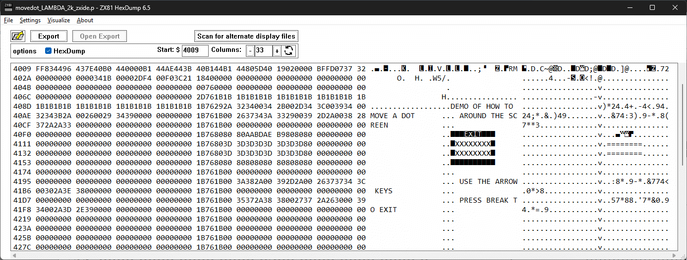
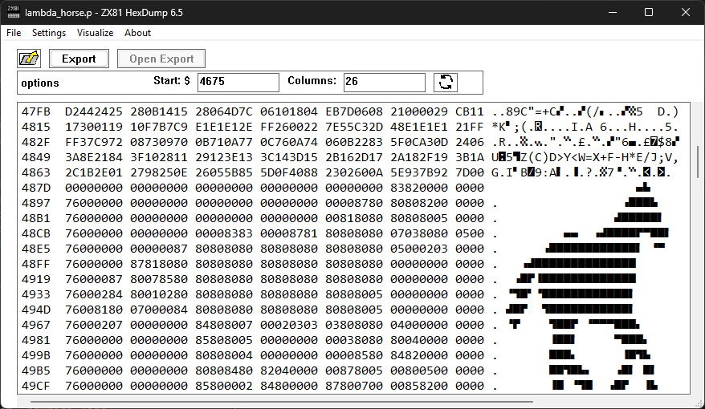

# ZX81 HexDump for Windows - a programmers app

ZX81 HexDump is a developer's utility for Sinclair ZX81 .P file programs. Used for display and analysis of binary data of the ZX81 program &mdash; including System Variables, BASIC program, Display File and BASIC variables). A file with .P extension is a tape image in byte format, converted from an original Sinclair ZX81 tape recording or created new with modern tools. The .P file can be sent out a big computer's sound card to the actual ZX81 hardware, or the .P file can be run in an emulator

* Supports <a href='https://www.bing.com/search?q=Sinclair+ZX81'>Sinclair ZX81</a>/Timex Sinclair 1000 home computer .P files
* Supports the derivative clone computers Lambda 8300/Power 3000/Marathon .P files

## ZX81 HexDump 6.5a (2024 November) Features:
* Win32 app coded in C++ using Visual Studio 2022
* App for Windows 11/Windows 10/Windows 8.1. May work with Windows 7 and Windows 8
* Generates a traditional hexdump-style output: hexadecimal display along with columns showing the ZX81 character set and the ASCII character set

* variable column view (2-33 columns)

|standard 33 columns (byte width of Display File)|32-column width aligns with character width of display (used by many programs)|
|:-:|:-:|
|||

* adjustable starting address for display. A ZX81 tape image always start at address 0x4009, but if you want to view, for example, the Display section, you can enter a different address

|display starting at program beginning|starting address adjusted to align with subset of data|
|:-:|:-:|
|||

* full menu support
* will use the True-Type font <a href='https://www.sinclairzxworld.com/viewtopic.php?p=14973#p14973'>sinclairZX.ttf</a> if installed

## Find Display Files
* Have you ever suspected a ZX81 program is using pre-rendered screen displays? This tool may find them in the program's machine code
 
* Visualize app screens and game levels: this feature searches for alternative display files
* Automatically detects and sizes the embedded Display File(s). Some games use the standard 33-byte wide display, other use smaller displays like the 26-column image shown
* Supports ZX81 & Lambda 8300 files
* The output is both visual (non-hexadecimal) and directly formatted for the <a href='https://www.sinclairzxworld.com/viewtopic.php?f=6&t=1064'>ZX-IDE assembler<a/>

# License
Use and modify ZX81 HexDump [as you see fit](UNLICENSE)

# Contributions
Contributions welcome. Requests considered

To do items (not implemented):
* Allow entering of System Variable names in the address box (e.g. VARS or DFILE) and have the hexdump start at that address. The header file 'zx81s.h' has the names and addresses

Stretch feature goal to implement: use a hover balloon or tooltip-style popup appear when the mouse is over a byte, showing more information. Examples:
* Keywords: when over the byte 0xEA it would show the keyword "REM"
* When over a System Variable (addresses 0x4009 to 0x407C) it would popup the name of the Variable and it's byte or word value
* Vertical text selection (ALT-drag support). ZX81 HexDump uses a standard EDIT control which doesn't have this type of selection
